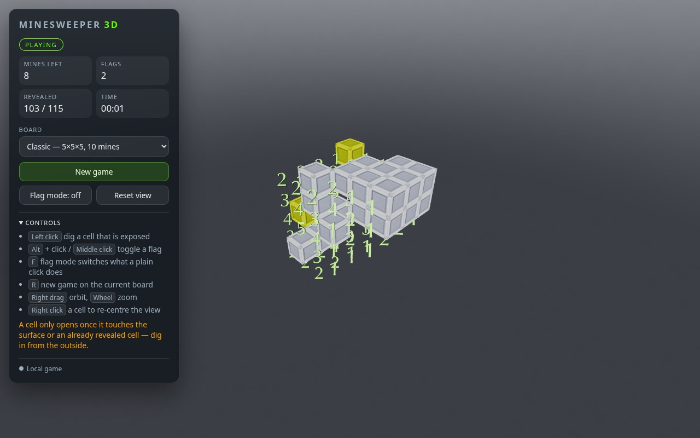

# Minesweeper 3D

A minesweeper played inside a cube: 26-neighbour danger counts, and mines you
have to dig towards from the surface instead of clicking anywhere.



The original prototype was a single-page PoC (one 253-line `entry.js`, a
vendored three.js r83, an express stub). It has been rebuilt as a typed,
tested monorepo: a pure rules engine shared by the browser and the server, a
Bun + TypeScript backend and a React + three.js client.

```
packages/game-core   pure, dependency-free rules engine  (bun test)
packages/server      Bun HTTP API + WebSocket hub + static hosting
packages/web         React 19 + three.js client (Vite)
```

Read [docs/ARCHITECTURE.md](docs/ARCHITECTURE.md) for the design and
[docs/PORTING-NOTES.md](docs/PORTING-NOTES.md) for what the prototype did, which
of its bugs are fixed, and the measured behavioural parity with the new engine.

## Quick start

```bash
bun install

bun run dev        # API on http://localhost:8000 + Vite dev server on http://localhost:5173
```

Open http://localhost:5173. The client plays in the browser by default; append
`?mode=remote` to play against the server instead.

Production mode serves the built client and the API from one Bun process:

```bash
bun run build      # builds packages/web into packages/web/dist
bun run start      # http://localhost:8000
```

## Controls

| Input | Action |
| --- | --- |
| Left click | Reveal a cell (only cells exposed to the surface can be opened) |
| `Alt` + click, middle click | Toggle a flag |
| `F` | Toggle flag mode (left click then flags instead of revealing) |
| `R` | New game on the current preset |
| Right drag | Orbit the camera |
| Wheel | Zoom |
| Right click | Focus the camera on the clicked cell |

## Commands

| Command | What it does |
| --- | --- |
| `bun run dev` | API (watch mode) + Vite dev server together |
| `bun run dev:server` / `bun run dev:web` | One side only |
| `bun run build` | Production build of the client |
| `bun run start` | Serve API + built client from Bun (default port 8000) |
| `bun test` | Unit + integration tests of all packages |
| `bun run typecheck` | `tsc --noEmit` for all packages |
| `bun run check` | Typecheck + tests |
| `bun run test:e2e` | Browser smoke test (builds, boots the server, plays a move) |

## The rules that make it 3D

1. **Danger counts span all 26 neighbours** — faces, edges and corners — so a
   cell can show up to 25. Implemented in `computeAdjacency`.
2. **You dig in from the outside.** A covered cell can only be opened when one
   of its six face neighbours is outside the board or already revealed
   (`isExposed`). That is what turns the board into something you excavate.
3. **The opening click never hits a mine** (`firstRevealSafe`, on by default):
   the mine is relocated instead. Set it to `false` for the original,
   merciless behaviour.
4. Flags protect cells from both clicks and the flood fill.

## Tests

| Suite | What it covers |
| --- | --- |
| `packages/game-core/test` | the rules: layout, adjacency, the digging rule, flood fill, flags, win/lose, safe opening, serialisation and a fuzzing suite of state invariants |
| `packages/server/test` | config, store/service semantics, the REST contract, static hosting and the realtime channel over real WebSockets |
| `packages/web/test` | pure camera/orbit maths, the local and remote sessions (with injected transport), the HUD and the app shell (Canvas mocked, no WebGL) |
| `packages/web/e2e` | a real browser: builds, boots the server, plays a move and screenshots the board |

```bash
bun run check      # typecheck + every unit/integration suite
bun run test:e2e   # needs a Chromium/Chrome binary (CHROME_PATH overrides)
```

## Known rough edges

- Numbers of *deep* layers overlap when the excavated side is viewed head-on;
  orbiting (or zooming) separates them. A recessed "floor" per revealed cell
  would read better and is the obvious next visual step.
- The board is one draw call for the covered cells but one mesh per mine; a
  10×10×10 board with 80 mines is fine, larger boards would want instancing
  there as well.
- The client bundle is a single ~1.2 MB chunk (three.js is most of it); code
  splitting is not worth it until there is more than one screen.

## Where to go next

The seams for the planned work are already in place:

- **Multiplayer**: `packages/server/src/realtime` broadcasts every accepted
  state change to all sockets subscribed to a game — no matter whether the
  action arrived over HTTP or over a socket — and `toClientView` redacts mines
  *and* danger counts of covered cells, so a room is a player model plus a
  second subscriber away.
- **Accounts / persistence**: implement the `GameStore` interface backed by a
  database instead of the in-memory map.
- **Server-authoritative client**: `RemoteGameSession` already speaks the whole
  HTTP + WebSocket protocol; `?mode=remote` uses it today.
